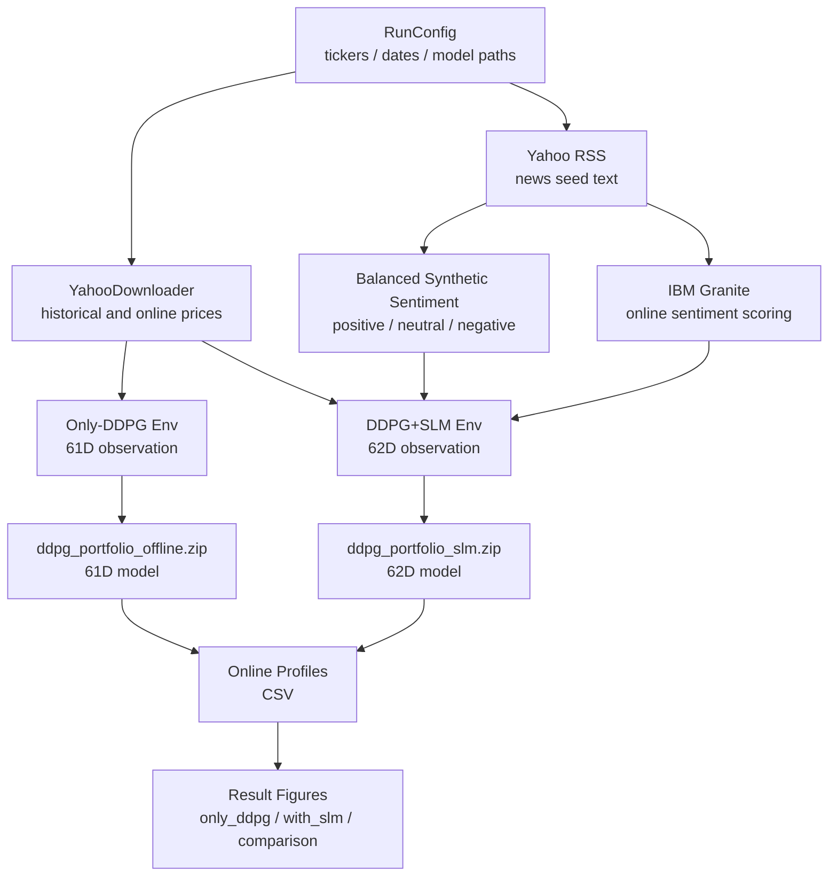

# The "Friendly" Patrick Bateman Model

<p align="center">
  
</p>

## Introduction

This project simulates long-term portfolio management for US stocks with
Deep Deterministic Policy Gradient (DDPG).

There are now two explicit routes:

- **Only-DDPG**
  - 61-dimensional observation.
  - Price and technical features only.
  - Uses `ddpg_portfolio_offline.zip`.

- **DDPG + SLM**
  - 62-dimensional observation.
  - Adds one sentiment feature from SLM/RSS processing.
  - Uses `ddpg_portfolio_slm.zip`.

The SLM route no longer reuses the 61D model by silently cutting off the sentiment
dimension. If the SLM route loads the wrong model, it fails clearly.

## Document Router

- [Source Modules](src/README.md)
  - Project-owned workflow package, training/evaluation APIs, synthetic sentiment, and comparison tools.

- [Environment API](envs/README.md)
  - Portfolio environment, 61D/62D observation design, action handling, reward, and SLM sentiment injection.

- [Result Addenda](addenda/README.md)
  - Generated figures, online profile CSV files, synthetic sentiment CSV, and comparison outputs.

- [Exploratory Model Notes](modle/README.md)
  - Earlier exploratory notebook/script material.

- [Tests](tests/README.md)
  - Local unit tests, smoke checks, and documentation routing checks.
 
## 0. install The  Fin_RL libary
```bash
  cd src
  git clone https://github.com/AI4Finance-Foundation/FinRL.git

  cd FinRL
  python3 -m venv venv

  source venv/bin/activate
  pip install -e .
```

source: https://github.com/AI4Finance-Foundation/FinRL

## 1. Quick Start

### 1.1 Pure 61D Only-DDPG

Use this route as the clean price-based baseline.

```bash
python main/main_code_only_ddpg.py
```

Main behavior:

- downloads online prices for `2026-01-01` to `2026-06-21`,
- builds `GymPortfolioEnv` with `use_slm=False`,
- loads `ddpg_portfolio_offline.zip`,
- saves profile CSV and figures.

Important outputs:

- `addenda/result_profile_comparse/only_ddpg_online_profile_2026-01-01_2026-06-21.csv`
- `addenda/result_picture/only_ddpg/`

### 1.2 62D DDPG + SLM

Use this route when testing whether a sentiment feature changes behaviour.

```bash
python main/main_code_add_slm.py
```

Main behavior:

- pulls Yahoo RSS seed news,
- uses IBM Granite to score online news sentiment,
- maps weekly sentiment to the online trading calendar,
- builds `GymPortfolioEnv` with `use_slm=True`,
- loads `ddpg_portfolio_slm.zip`,
- saves profile CSV and figures.

Important outputs:

- `addenda/result_profile_comparse/ddpg_slm_online_profile_2026-01-01_2026-06-21.csv`
- `addenda/result_picture/with_slm/`

### 1.3 Train the 62D SLM Model

The SLM model is separate from the price-only model.

```bash
python main/main_code_add_slm.py --train-slm
```

This path:

- downloads historical prices,
- loads or generates balanced synthetic sentiment,
- trains a 62D DDPG model,
- saves `ddpg_portfolio_slm.zip`.

The current `ddpg_portfolio_slm.zip` is a bootstrap model trained with a small
`total_timesteps` value for pipeline verification. For serious experiments,
increase `total_timesteps` in `RunConfig`.

### 1.4 Compare Both Routes

```bash
python src/tool/compare_ddpg_profiles.py
```

This writes:

- `addenda/result_profile_comparse/ddpg_vs_slm_comparison_2026-01-01_2026-06-21.csv`
- `addenda/result_picture/comparison/reward_daily_return_difference_2026-01-01_2026-06-21.png`

## 2. Current Data Flow



## 3. Project Structure

```text
.
├── README.md
├── addenda/
│   ├── result_picture/
│   │   ├── only_ddpg/
│   │   ├── with_slm/
│   │   └── comparison/
│   ├── result_profile_comparse/
│   └── synthetic_sentiment/
├── envs/
│   └── gym_portfolio_env.py
├── main/
│   ├── main_code_only_ddpg.ipynb
│   ├── main_code_only_ddpg.py
│   ├── main_code_add_slm.ipynb
│   └── main_code_add_slm.py
├── src/
│   ├── finance_rl_slm/
│   ├── tool/
│   └── FinRL/
└── tests/
```

## 4. Verification

Run the local verification suite:

```bash
python -B -m unittest discover -s tests -p 'test_*.py' -v
```

Important checks:

- Only-DDPG model observation space is `(61,)`.
- DDPG+SLM model observation space is `(62,)`.
- Synthetic sentiment labels are balanced.
- Result figures are saved into the correct folders.
- Comparison CSV and comparison figure are generated.

## 5. Maintenance Notes

- Keep `.py` and `.ipynb` versions aligned.
- Keep 61D and 62D models separate.
- Do not use `ddpg_portfolio_offline.zip` for SLM decisions.
- If result paths change, update:
  - this README,
  - folder README files,
  - `tests/test_results_and_docs.py`,
  - `src/tool/compare_ddpg_profiles.py`.
