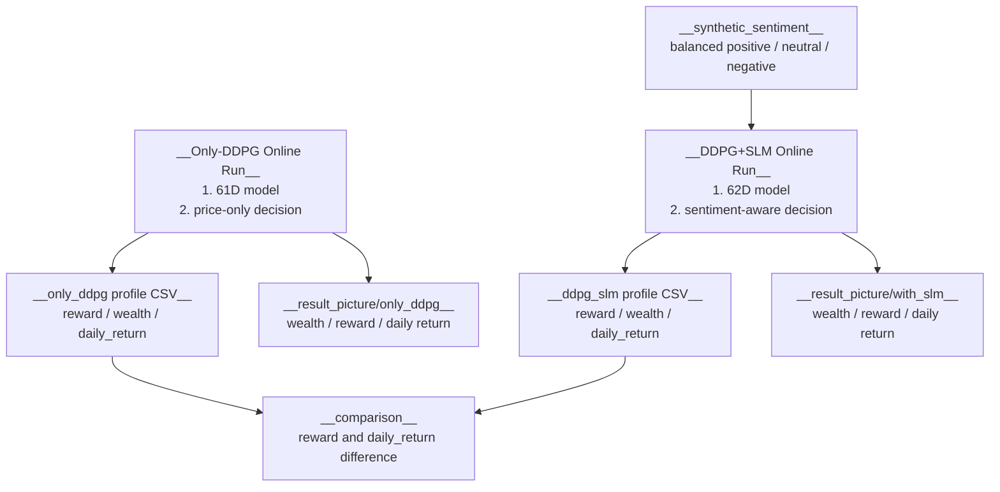

# Result Addenda

## What Is Here

- This folder stores generated experiment artifacts.

- Main folders:
  - `result_picture/`
  - `result_profile_comparse/`
  - `synthetic_sentiment/`

- This folder has no Python `def` functions.
  - It still has an output contract.
  - The table below describes the artifact API used by scripts and tests.

## 1. Artifact Flow



## 2. API Overview

| Function | Role |
|---|---|
| `result_picture/only_ddpg/` | Store plots produced by the 61D Only-DDPG online route. |
| `result_picture/with_slm/` | Store plots produced by the 62D DDPG+SLM online route. |
| `result_picture/comparison/` | Store comparison plots between reward and daily return. |
| `result_profile_comparse/only_ddpg_online_profile_2026-01-01_2026-06-21.csv` | Store step-level online profile for Only-DDPG. |
| `result_profile_comparse/ddpg_slm_online_profile_2026-01-01_2026-06-21.csv` | Store step-level online profile for DDPG+SLM. |
| `result_profile_comparse/ddpg_vs_slm_comparison_2026-01-01_2026-06-21.csv` | Store mean return, standard deviation, and reward comparison summary. |
| `synthetic_sentiment/balanced_rss_sentiment_2011-01-01_2025-12-31.csv` | Store balanced synthetic sentiment used for 62D SLM-aware training. |

## Common Checks

- Confirm artifact contract:

  ```bash
  rtk python -B -m unittest tests.test_results_and_docs.ResultsAndDocsTests.test_output_contract_artifacts_exist -v
  ```

- Keep output naming stable:
  - include method name,
  - include date range,
  - put Only-DDPG and DDPG+SLM images in separate folders.
