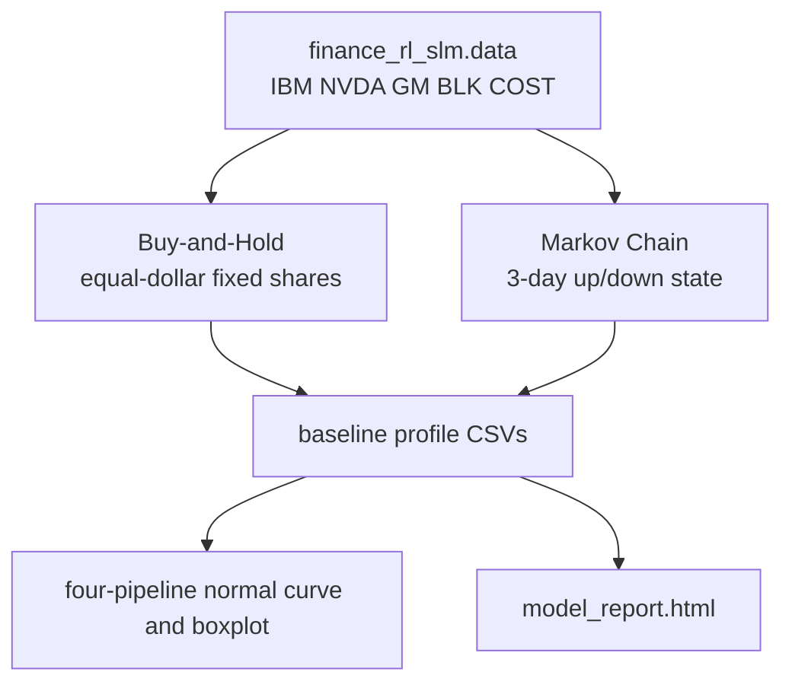

# Baseline Strategies

## What Is Here

- This folder contains two non-RL baselines for the same five-stock online window used by the DDPG workflows.
- The baselines write profile CSV files that match the existing dashboard and comparison contract.
- Price data is loaded through `src/finance_rl_slm/data.py::download_price_df()`.

## 1. Baseline Flow



## 2. API Overview

| Function | Role |
|---|---|
| `build_buy_hold_profile()` | Buy five tickers equally by dollar value, keep shares fixed, and record wealth. |
| `train_markov_chain_model()` | Estimate three-day up/down transition probabilities from historical prices. |
| `build_markov_chain_profile()` | Run the Markov baseline over the online price window. |
| `save_baseline_profile()` | Save profile CSVs with `time`, `wealth`, `reward`, `drawdown`, `action`, and `daily_return`. |
| `baseline/run_baselines.py` | Generate both baselines and refresh four-pipeline outputs. |

## Common Checks

- Generate baselines through the Web report entrypoint:

  ```bash
   python version/run_model_report.py --no-serve
  ```

- Generate both baseline profiles, plots, and HTML:

  ```bash
   python baseline/run_baselines.py
  ```

- Generate only baseline profile CSVs:

  ```bash
   python baseline/run_baselines.py --skip-report
  ```

## Notes

- The Buy-and-Hold route uses `100000 USD`, buys each ticker with 20% of capital on the first online trading date, and never changes share count.
- The Markov Chain route uses only the previous three trading days of ticker-level up/down signs for its decision state.
- No transaction cost, slippage, tax, or brokerage simulation is included in this baseline version.
- Baseline profile CSVs are stored under `addenda/result_base_line/` by default.
