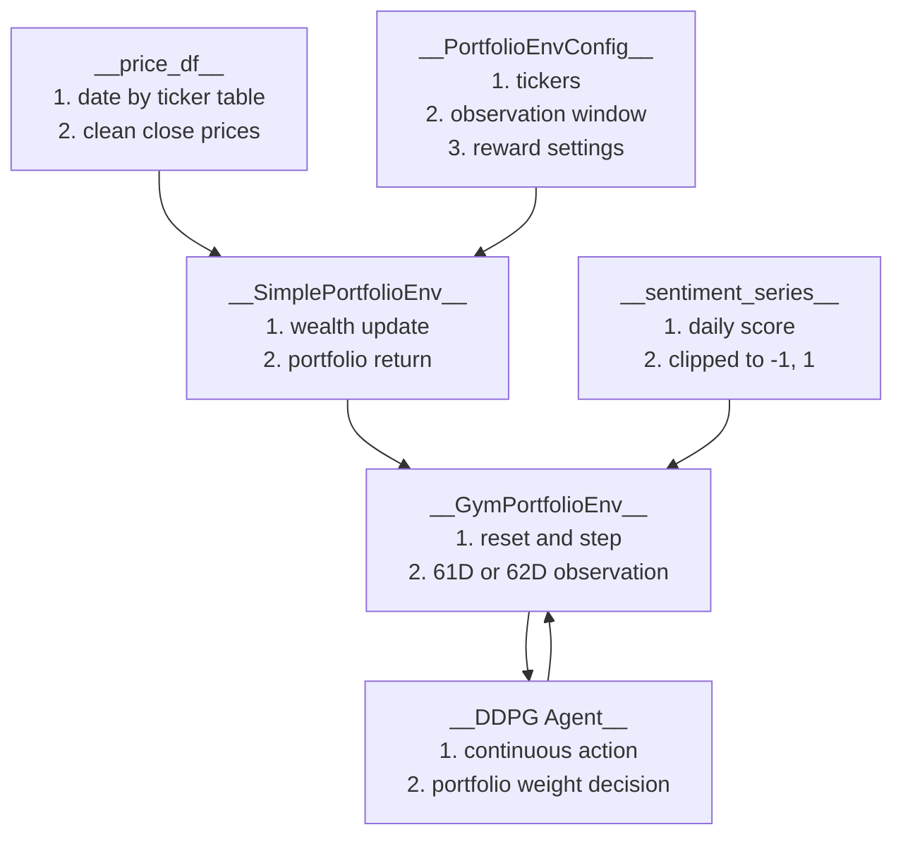

# Environment API

## What Is Here

- This folder contains the custom portfolio environment used by the DDPG agent.

- Main file:
  - `gym_portfolio_env.py`

- Main idea:
  - `SimplePortfolioEnv` handles core wealth movement.
  - `GymPortfolioEnv` exposes the Gymnasium API for Stable-Baselines3.

## 1. Environment Flow



## 2. API Overview

| Function | Role |
|---|---|
| `BaseEnv` | Abstract base class for `reset()` and `step()` environment behavior. |
| `PortfolioEnvConfig` | Store environment settings such as tickers, initial wealth, and reward window. |
| `validate_price_df()` | Check required ticker columns, sort by date, and reject empty price data. |
| `SimplePortfolioEnv` | Hold the core price table, portfolio wealth, and return calculation. |
| `SimplePortfolioEnv.reset()` | Reset core wealth state to the first tradable step. |
| `SimplePortfolioEnv.step()` | Apply portfolio weights and update wealth using next-day returns. |
| `ema()` | Compute an exponential moving average used by technical state features. |
| `GymPortfolioEnv` | Gymnasium wrapper used by DDPG training and online evaluation. |
| `GymPortfolioEnv.__init__()` | Build action space, observation space, and optional SLM feature shape. |
| `GymPortfolioEnv.set_sentiment_series()` | Attach daily SLM sentiment scores to the environment. |
| `GymPortfolioEnv.action_to_weight()` | Clip and normalize continuous DDPG actions into portfolio weights. |
| `GymPortfolioEnv.reset()` | Reset the Gym environment and return the first observation. |
| `GymPortfolioEnv.step()` | Execute one RL step and return observation, reward, done flags, and info. |

## Common Checks

- Run environment tests:

  ```bash
  rtk python -B -m unittest tests.test_online_env_api -v
  ```

- Keep these behaviors stable:
  - Only-DDPG observation shape is 61D.
  - DDPG+SLM observation shape is 62D.
  - Sentiment value is clipped into `[-1, 1]`.
  - Actions are always clipped and normalized.
  - Empty train or validation price data raises a clear error.
