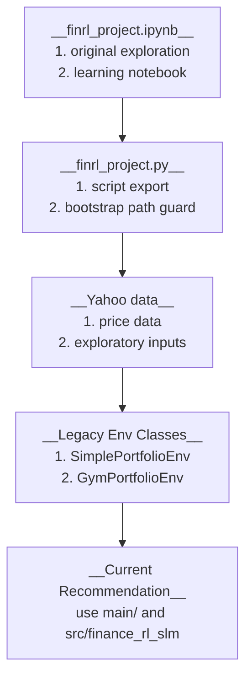

# Exploratory Model Notes

## What Is Here

- This folder contains earlier exploratory project code.

- The directory name stays as `modle` because the repository already uses this name.

- This folder is useful for learning history.
  - It is not the recommended main workflow.
  - Use `main/` and `src/finance_rl_slm/` for current 61D and 62D runs.

## 1. Legacy Flow



## 2. API Overview

| Function | Role |
|---|---|
| `BaseEnv` | Legacy abstract environment interface. |
| `PortfolioEnvConfig` | Legacy environment configuration dataclass. |
| `SimplePortfolioEnv` | Legacy core portfolio environment for price and wealth movement. |
| `SimplePortfolioEnv.reset()` | Reset legacy portfolio wealth state. |
| `SimplePortfolioEnv.step()` | Run one legacy portfolio step. |
| `GymPortfolioEnv` | Legacy Gymnasium wrapper for the exploratory notebook. |
| `GymPortfolioEnv.__init__()` | Build legacy action and observation spaces. |
| `GymPortfolioEnv.action_to_weight()` | Convert legacy action vector into portfolio weights. |
| `GymPortfolioEnv.reset()` | Reset the legacy Gym environment. |
| `GymPortfolioEnv.step()` | Run one legacy Gym step and calculate reward. |

## Common Checks

- Compile the legacy script:

  ```bash
  rtk python -B -m py_compile modle/finrl_project.py
  ```

- Important note:
  - Direct execution may download market data.
  - Treat this folder as exploratory reference, not the main experiment path.
