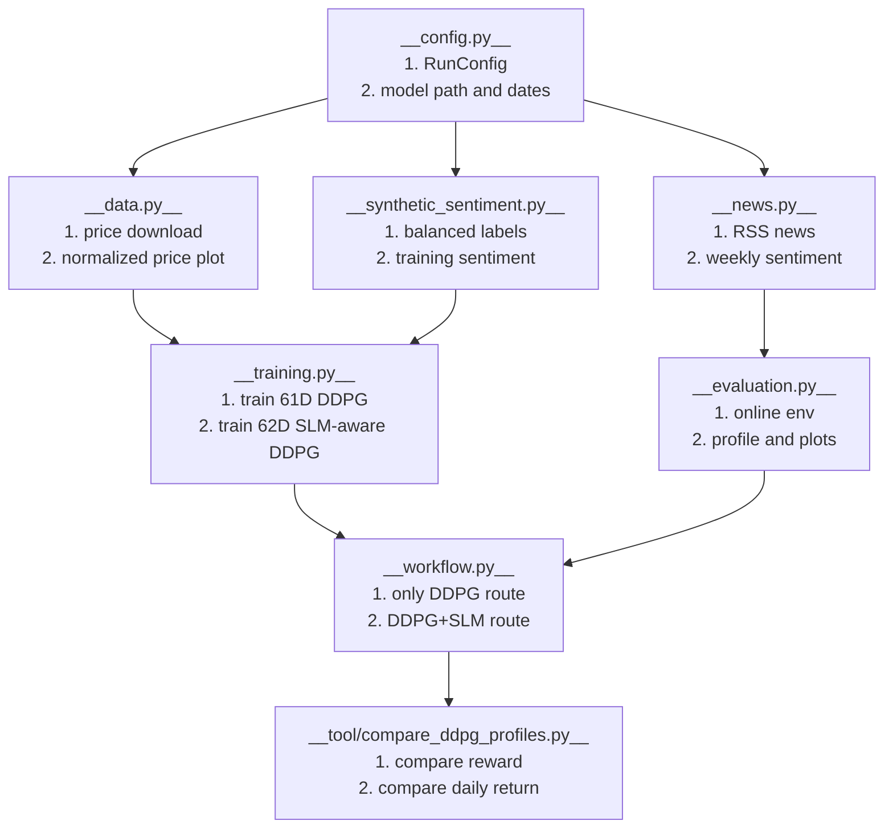

# Source Modules

## What Is Here

- `finance_rl_slm/`
  - Main project package.
  - Holds configuration, data loading, sentiment, synthetic sentiment, training, evaluation, and workflow routing.

- `tool/`
  - Utility scripts for experiment comparison.

- `FinRL/`
  - Embedded upstream FinRL package.
  - Keep changes small unless the bug is inside this dependency.

- `SLM_emo_analizy/`
  - Legacy or reserved folder.
  - It is not the main route now.

## 1. Module Flow



## 2. API Overview

| Function | Role |
|---|---|
| `RunConfig` | Store tickers, date ranges, model paths, SLM model id, and DDPG hyper-parameters. |
| `RunConfig.ticker_list` | Return tickers as a normal Python list. |
| `RunConfig.rss_urls` | Build Yahoo Finance RSS URLs for all tickers. |
| `download_price_df()` | Download price data and return a date by ticker price table. |
| `plot_normalized_prices()` | Plot normalized price curves for quick data checking. |
| `fetch_yahoo_news_texts()` | Read Yahoo RSS text items for one ticker. |
| `analyze_news_feed()` | Score news items and prepare sentiment rows. |
| `label_to_score()` | Convert positive, neutral, and negative labels into numeric score. |
| `build_weekly_market_sentiment()` | Aggregate news sentiment into weekly market sentiment. |
| `weekly_to_daily_sentiment()` | Align weekly sentiment to the daily trading index. |
| `GraniteSentimentAnalyzer` | Wrap IBM Granite sentiment prompting and JSON parsing. |
| `parse_sentiment_output()` | Parse raw Granite output into a Python dictionary. |
| `get_default_analyzer()` | Build the default Granite analyzer from project config. |
| `ask_granite()` | Send one prompt to Granite through the default analyzer. |
| `analyze_sentiment()` | Score one news text as sentiment output. |
| `synthetic_sentiment_filename()` | Build the standard synthetic sentiment CSV file name. |
| `synthetic_sentiment_path()` | Build the standard synthetic sentiment CSV path. |
| `fetch_rss_seed_texts()` | Collect RSS text seeds for synthetic sentiment generation. |
| `_seed_text_for()` | Pick one seed text for one synthetic sentiment row. |
| `generate_balanced_rss_sentiment()` | Create balanced positive, neutral, and negative sentiment rows. |
| `assert_balanced_sentiment()` | Validate that sentiment labels are balanced enough. |
| `save_balanced_rss_sentiment()` | Save balanced synthetic sentiment to CSV. |
| `load_synthetic_sentiment()` | Load synthetic sentiment CSV with date parsing. |
| `sentiment_frame_to_daily_market_series()` | Convert sentiment rows into a daily numeric market series. |
| `build_or_load_balanced_sentiment()` | Reuse an existing synthetic CSV or build a new one. |
| `business_dates_for_training_config()` | Build business dates for historical SLM-aware training. |
| `make_portfolio_config()` | Convert `RunConfig` into `PortfolioEnvConfig`. |
| `_make_ddpg()` | Build the Stable-Baselines3 DDPG model object. |
| `_print_env_probe()` | Print one environment reset probe for debugging. |
| `_validation_wealth_plot()` | Save a validation wealth plot after training. |
| `train_offline_model()` | Train the 61D price-only DDPG model. |
| `_align_sentiment()` | Align sentiment data to a price dataframe index. |
| `train_slm_aware_model()` | Train the 62D DDPG+SLM model with sentiment feature. |
| `PredictModel` | Protocol for models that expose `predict()`. |
| `OnlineEvaluationConfig` | Store online evaluation options and output names. |
| `create_online_env()` | Build a 61D or 62D online `GymPortfolioEnv`. |
| `load_online_model()` | Load and validate a DDPG model for online evaluation. |
| `resolve_model_path()` | Resolve model path and fail clearly if it is missing. |
| `run_debug_steps()` | Print short debug steps for model and environment behavior. |
| `collect_online_logs()` | Run one online episode and collect step-level logs. |
| `add_online_metrics()` | Add daily return and related metrics to profile logs. |
| `date_range_tag()` | Build a date tag such as `2026-01-01_2026-06-21`. |
| `profile_filename()` | Build a standard online profile CSV filename. |
| `_format_action_for_csv()` | Serialize action vectors into stable CSV text. |
| `save_online_profile()` | Save online profile logs into `addenda/result_profile_comparse`. |
| `_finish_plot()` | Finish and save a matplotlib figure. |
| `plot_online_logs()` | Save online wealth, reward, and daily-return figures. |
| `run_online_evaluation()` | Run full online evaluation and output profile plus images. |
| `PriceSplits` | Store train and validation price dataframes. |
| `print_runtime_context()` | Print Python and project path information. |
| `build_sentiment_inputs()` | Build RSS URL inputs for sentiment scoring. |
| `load_price_data()` | Load historical price data for offline training. |
| `_validate_split()` | Check that train or validation split is not empty. |
| `split_price_data()` | Split historical price data into train and validation windows. |
| `load_online_price_data()` | Load online date-range price data. |
| `build_daily_sentiment()` | Build daily online sentiment from RSS and Granite. |
| `_project_output_path()` | Build a project-root relative output path and create parents. |
| `result_picture_path()` | Return `addenda/result_picture`. |
| `only_ddpg_picture_path()` | Return `addenda/result_picture/only_ddpg`. |
| `with_slm_picture_path()` | Return `addenda/result_picture/with_slm`. |
| `comparison_picture_path()` | Return `addenda/result_picture/comparison`. |
| `result_profile_path()` | Return `addenda/result_profile_comparse`. |
| `synthetic_sentiment_dir_path()` | Return `addenda/synthetic_sentiment`. |
| `build_historical_synthetic_sentiment()` | Build or load synthetic training sentiment. |
| `build_historical_market_sentiment()` | Convert historical synthetic sentiment into daily market series. |
| `run_only_ddpg_online()` | Run 61D Only-DDPG online evaluation. |
| `run_slm_online()` | Run 62D DDPG+SLM online evaluation. |
| `run_only_ddpg_main()` | Main script route for Only-DDPG. |
| `run_slm_main()` | Main script route for DDPG+SLM. |
| `train_slm_model_from_price_data()` | Train and save the 62D SLM-aware model. |
| `run_main()` | Default high-level project entry route. |
| `ensure_project_paths()` | Add project paths to `sys.path` for scripts and notebooks. |
| `ProfileMetrics` | Store one pipeline's return and risk summary. |
| `compare_ddpg_profiles.profile_filename()` | Build comparison input profile names. |
| `comparison_filename()` | Build comparison CSV filename. |
| `comparison_plot_filename()` | Build comparison plot filename. |
| `aligned_daily_return_plot_filename()` | Build the shared-y-axis daily-return overlay plot filename. |
| `online_daily_return_plot_filename()` | Build the standard standalone daily-return plot filename. |
| `distribution_plot_filename()` | Build the normal-distribution comparison plot filename. |
| `box_plot_filename()` | Build the daily-return boxplot filename. |
| `default_profile_path()` | Resolve the default path for one profile CSV. |
| `load_profile()` | Load a profile CSV and validate required columns. |
| `compute_profile_metrics()` | Compute mean return, reward, standard deviation, and total return. |
| `compare_profiles()` | Compare Only-DDPG and DDPG+SLM profile metrics. |
| `write_comparison()` | Write comparison table to CSV. |
| `compute_shared_ylim()` | Build one y-axis range that covers both daily-return series. |
| `plot_daily_return_overlay()` | Save Only-DDPG and DDPG+SLM daily returns in one shared-y-axis figure. |
| `plot_aligned_individual_daily_returns()` | Refresh standalone Only-DDPG and DDPG+SLM daily-return plots with shared y-axis limits. |
| `plot_profile_distribution()` | Save overlaid normal curves using one shared mean and each model's own standard deviation. |
| `plot_profile_boxplot()` | Save one boxplot figure containing both model daily-return distributions. |
| `plot_profile_differences()` | Save reward and daily-return difference plot. |
| `parse_args()` | Parse command-line arguments for the comparison tool. |
| `main()` | Run the comparison tool and create the CSV plus all comparison plots. |

## Common Checks

- Run local tests:

  ```bash
  python -B -m unittest discover -s tests -p 'test_*.py' -v
  ```

- Run the comparison tool:

  ```bash
  python src/tool/compare_ddpg_profiles.py
  
  ```

- Important rule:
  - 61D Only-DDPG uses `ddpg_portfolio_offline.zip`.
  - 62D DDPG+SLM uses `ddpg_portfolio_slm.zip`.
