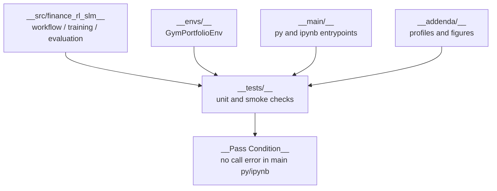

# Tests

## What Is Here

- This folder contains local `unittest` coverage for the project-owned workflow.

- It does not replace the embedded FinRL upstream test suite.

- The goal is practical safety:
  - import safety,
  - environment shape safety,
  - notebook/script call safety,
  - result artifact routing,
  - SLM-aware 62D routing.

## 1. Test Flow



## 2. API Overview

| Function | Role |
|---|---|
| `FinanceRlSlmTests` | Test package import, sentiment parsing, and basic helper behavior. |
| `MainCallSafetyDocRouterTests` | Test main scripts, notebooks, split validation, and README router links. |
| `ResultsAndDocsTests` | Test result folders, comparison outputs, and documentation files. |
| `SlmAwareRoutingTests` | Test 61D/62D model routing, synthetic sentiment balance, and SLM image routing. |
| `ConstantModel` | Small fake model used for online environment tests. |
| `make_price_df()` | Build a small deterministic price dataframe for tests. |
| `OnlineEnvApiTests` | Test online environment creation, action handling, model path errors, and profile output. |

## Common Checks

- Run all local tests:

  ```bash
  rtk python -B -m unittest discover -s tests -p 'test_*.py' -v
  ```

- Keep tests lightweight:
  - do not require full DDPG training,
  - avoid network-only assertions,
  - prefer small deterministic dataframes,
  - verify output paths when changing artifact routing.
