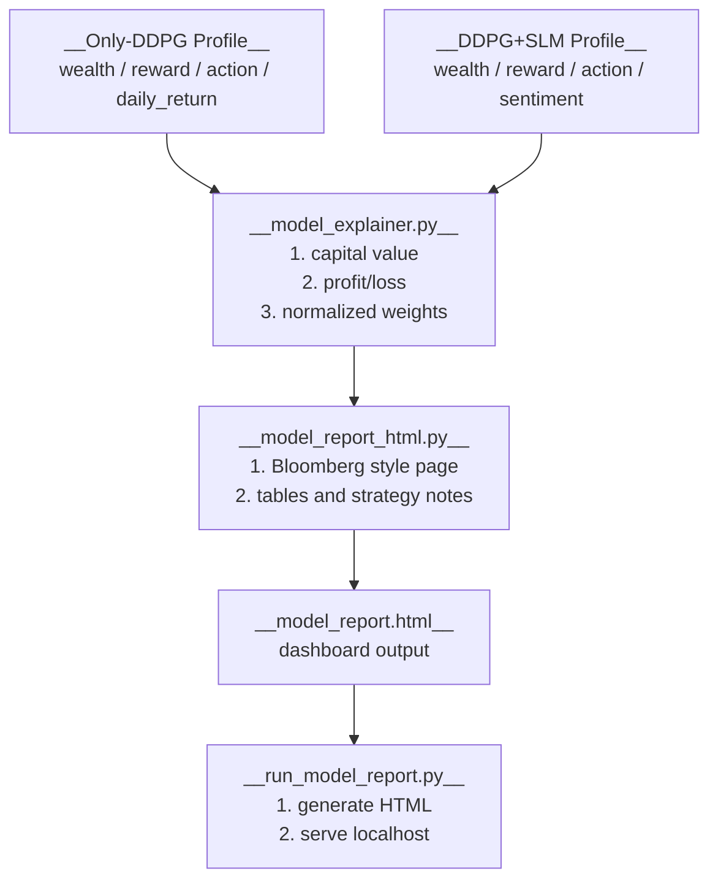

# Version Dashboard

## What Is Here

- This folder explains the two online model profiles in money and strategy terms.

- Main outputs:
  - investment value,
  - profit/loss,
  - strategy analysis,
  - Bloomberg-terminal style HTML report.

- Default dashboard command:

  ```bash
  python version/run_model_report.py
  ```

## 1. Dashboard Flow



## 2. API Overview

| Function | Role |
|---|---|
| `load_profile()` | Load one profile CSV and validate required columns. |
| `parse_action_vector()` | Convert serialized action text into a numeric vector. |
| `normalize_action_to_weights()` | Clip negative action values and normalize weights to sum to one. |
| `action_weight_frame()` | Convert all profile action rows into a ticker weight table. |
| `calculate_investment_value()` | Convert normalized wealth into money value. |
| `calculate_profit_loss()` | Calculate money profit/loss against initial capital. |
| `calculate_average_turnover()` | Measure average portfolio allocation change between steps. |
| `summarize_strategy()` | Build one model summary with return, drawdown, capital, and allocation fields. |
| `build_strategy_notes()` | Build short strategy explanation notes for one model. |
| `compare_model_profiles()` | Load Only-DDPG and DDPG+SLM profiles and return side-by-side data. |
| `format_money()` | Format money values with the selected currency. |
| `format_percent()` | Format ratio values as percentages. |
| `generate_dashboard_html()` | Build the terminal-style dashboard HTML string. |
| `write_dashboard_html()` | Write dashboard HTML to disk. |
| `build_dashboard_report()` | Build comparison data and write `model_report.html`. |
| `build_parser()` | Build CLI parser for the report server. |
| `serve_report()` | Serve the generated report directory on localhost. |
| `main()` | Generate the report and start the server unless `--no-serve` is used. |

## Common Checks

- Generate report without starting the server:

  ```bash
  python version/run_model_report.py --no-serve
  ```

- Run the dashboard:

  ```bash
  python version/run_model_report.py
  ```

- Run tests:

  ```bash
  python -B -m unittest discover -s tests -p 'test_*.py' -v
  ```

## Notes

- Default capital is `100000 USD`.

- The report uses existing CSV profiles.
  - It does not retrain DDPG.
  - It does not rerun online evaluation.

- The `action` column is raw model output.
  - The dashboard converts it into non-negative normalized portfolio weights before explaining strategy.
